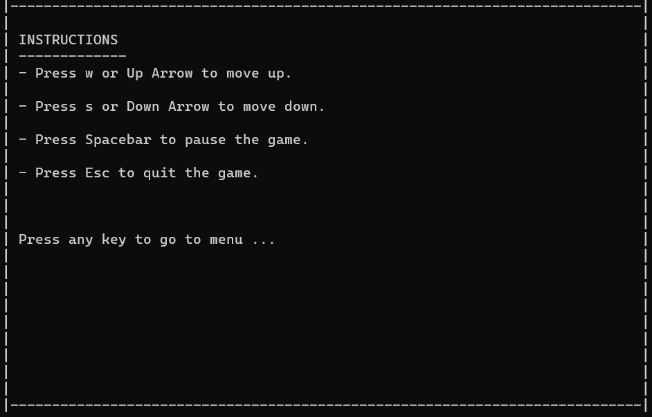

# Ping Pong Game

## Description

This console-based ping pong game was developed using C++. The game allows players to compete against a computer opponent. Players can control their striker using the ↑ and ↓ arrow keys to hit the ball. The computer opponent's position changes dynamically based on the ball's location. The game also features a pause option and displays the final score at the end.

## Screenshots

## How to Play

1. Use the ↑ and ↓ arrow keys to control the player's striker.
2. The objective is to hit the ball and prevent it from passing your striker.
3. The computer opponent will dynamically adjust its position to hit the ball.
4. Pause the game by pressing the 'P' key.
5. The game ends when the ball passes your striker or the computer opponent's striker.
6. The final score is displayed at the end.

## Requirements

- C++ compiler
- Keyboard arrow keys (↑, ↓) for player control
- Terminal or command prompt to run the game

## Instructions to Run the Game

1. Clone the repository: `git clone https://github.com/bhaveymunjal/Ping-Pong-Game.git`
2. Navigate to the project directory: `cd Ping-Pong-Game`
3. Compile the game: `g++ ping.cpp -o ping`
4. Run the game: `./ping`

## Contributing

If you would like to contribute to this project, feel free to fork the repository and submit pull requests with your enhancements or bug fixes.

## Feedback

If you have any suggestions, feature requests, or bug reports, please open an issue on the project's GitHub page.
